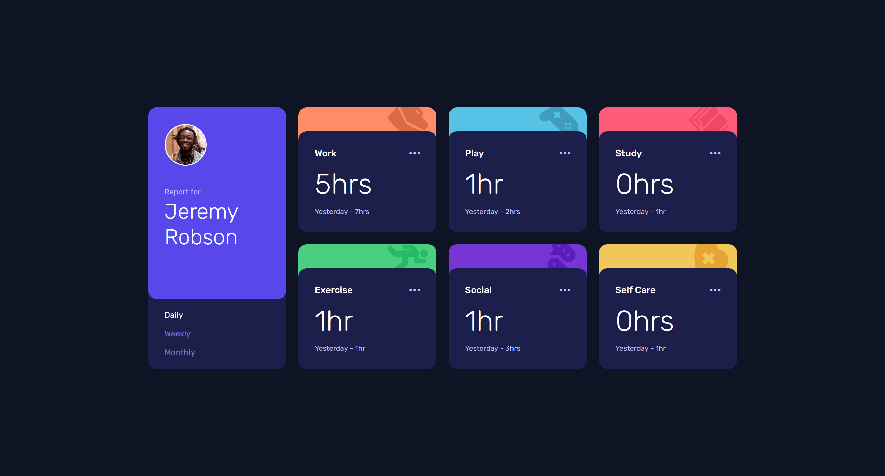

# Frontend Mentor - Time tracking dashboard solution

This is a solution to the [Time tracking dashboard challenge on Frontend Mentor](https://www.frontendmentor.io/challenges/time-tracking-dashboard-UIQ7167Jw). Frontend Mentor challenges help you improve your coding skills by building realistic projects.

## Table of contents

- [Overview](#overview)
  - [The challenge](#the-challenge)
  - [Screenshot](#screenshot)
  - [Links](#links)
- [My process](#my-process)
  - [Built with](#built-with)
  - [What I learned](#what-i-learned)
  - [Useful resources](#useful-resources)
- [Author](#author)

**Note: Delete this note and update the table of contents based on what sections you keep.**

## Overview

### The challenge

Users should be able to:

- View the optimal layout for the site depending on their device's screen size
- See hover states for all interactive elements on the page
- Switch between viewing Daily, Weekly, and Monthly stats

### Screenshot

### Links

- Live Site URL: [https://sebastianbr11.github.io/csb-xi167/](https://sebastianbr11.github.io/csb-xi167/)

## My process

### Built with

- HTML5 markup
- CSS custom properties
- Flexbox
- CSS Grid
- Mobile-first workflow
- [Svelte](https://svelte.dev)

### What I learned

To import the svg icons I made a svelte file for each icon and used the rollup-plugin-inline-svg node package to use them.
Then I made an IconType component which had an object with key value pairs of icon name and icon component, and used that object
with a prop called name with which I then displayed the correct icon with svelte:component.

### Useful resources

- [Codesandbox](https://codesandbox.io)

## Author

- Frontend Mentor - [@SebastianBr11](https://www.frontendmentor.io/profile/SebastianBr11)
